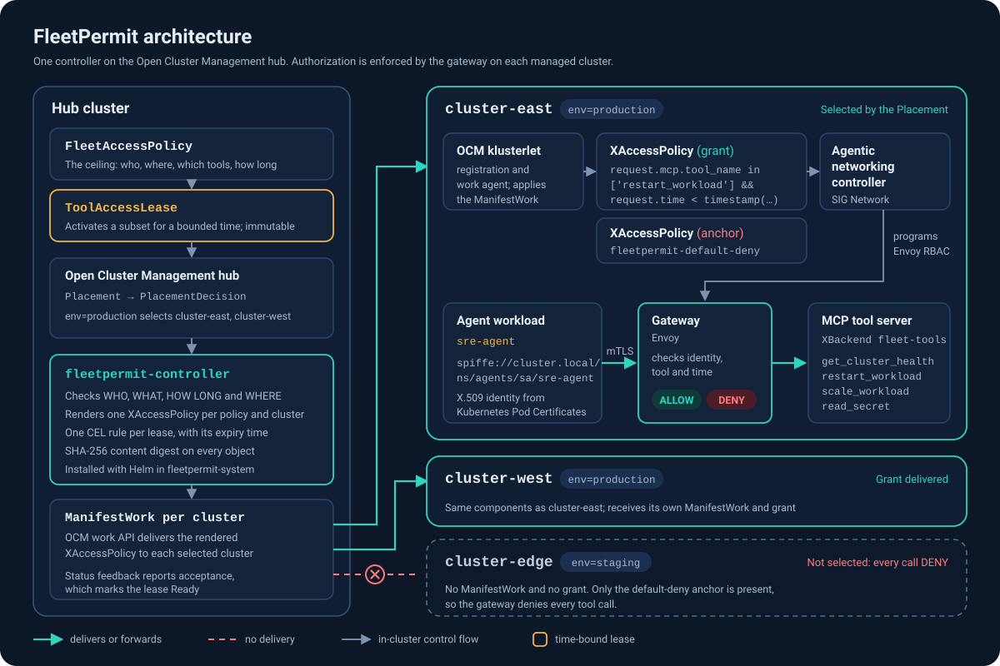

<p align="center">
  
</p>

<h3 align="center">Least privilege for agents, across every cluster.</h3>

<p align="center">Define who can call which tool, on which clusters, and for how long.</p>

<p align="center">
  <a href="https://github.com/fleetpermit/fleetpermit/actions/workflows/ci.yaml"></a>
  <a href="https://github.com/fleetpermit/fleetpermit/actions/workflows/e2e.yaml"></a>
  <a href="LICENSE"></a>
  <a href="docs/upstream-compatibility.md"></a>
  <a href="https://fleetpermit.github.io/"></a>
</p>

<p align="center">
  
</p>

FleetPermit gives AI agents **time-bound, fleet-wide authorization** to call tools. You write one
policy that says *which workload identities* may call *which MCP tools* on *which clusters*. Access
is then activated with a short-lived lease, delivered to exactly the clusters your placement selects,
and enforced by each cluster's gateway. It expires on time even when the fleet hub is unreachable.

An agent here is just a workload with a [SPIFFE](https://spiffe.io/) identity making a standards-based
tool call. FleetPermit does not depend on any model, agent framework, cloud or vendor.

## See it run

<p align="center">
  
</p>

A real run of `make demo-run` against the lab (sped up 1.3×; every ALLOWED and DENIED line is a
real MCP call through a real gateway). Full-length MP4s:
[overview](https://fleetpermit.github.io/assets/video/demo-overview.mp4) ·
[security checks](https://fleetpermit.github.io/assets/video/demo-security.mp4) ·
[hub disconnected](https://fleetpermit.github.io/assets/video/demo-disconnected-expiry.mp4).

## Why FleetPermit?

Agent authorization today is configured **cluster by cluster**. Fleets are not static: clusters join
and leave, their labels change, and the tool access an incident needs should last minutes, not
forever. Kubernetes SIG Network's [kube-agentic-networking](https://github.com/kubernetes-sigs/kube-agentic-networking)
project defines authorization for agent-to-tool traffic, down to individual MCP tools, on one
cluster. [Open Cluster Management](https://open-cluster-management.io/) decides which clusters
something belongs on and delivers it there. FleetPermit composes the two:

| Question | Answered by | FleetPermit field |
|---|---|---|
| **Who?** | a SPIFFE ID, authenticated with mTLS at the gateway | `subjects`, `lease.subject` |
| **Where?** | an OCM `Placement` and its `PlacementDecision`s | `placement.placementRef` |
| **What?** | MCP tool names, matched by the gateway | `permissions` |
| **How long?** | a lease whose expiry is part of the enforced rule | `lease.maxDuration`, `lease.duration` |

## How it works

<p align="center"></p>

1. A platform team writes a **`FleetAccessPolicy`**: the ceiling of what may ever be granted.
2. Someone (a person or an automation) creates a **`ToolAccessLease`** for a subset of that authority,
   for example `restart_workload` for 10 minutes.
3. The **fleetpermit-controller** on the OCM hub checks the lease. The subject must be in the policy,
   the tools must be a subset of its permissions, and the duration must not exceed its maximum. It then
   resolves the placement to a set of clusters. A lease can narrow the placement, never widen it.
4. For every selected cluster it renders one upstream **`XAccessPolicy`** in which each lease is a
   CEL rule, stamps it with a SHA-256 content digest, and delivers it with an OCM **`ManifestWork`**:
   ```
   request.mcp.tool_name in ['restart_workload'] && request.time < timestamp('2026-09-26T10:15:00Z')
   ```
5. The OCM work agent applies it and the agentic-networking controller programs **Envoy**. The agent's
   tool call is allowed only if its mTLS identity, the tool and the current time all match. On the
   expiry instant the gateway itself starts denying, with no dependency on the hub, FleetPermit or
   the network between them. FleetPermit then withdraws the expired grant.

FleetPermit is one controller and two CRDs. There is no agent to install on managed clusters: the
time bound travels inside the policy the gateway already enforces. [Why that is enough](docs/design.md).

## 30-second example

```yaml
apiVersion: fleetpermit.github.io/v1alpha1
kind: FleetAccessPolicy
metadata: {name: sre-remediation, namespace: fleet}
spec:
  subjects:
    - spiffeID: spiffe://cluster.local/ns/agents/sa/sre-agent
  placement:
    placementRef: {name: production-clusters}     # an OCM Placement
  target:
    namespace: mcp-tools
    ref: {kind: XBackend, name: fleet-tools}      # the MCP server behind the gateway
  permissions:
    - tool: get_cluster_health
    - tool: restart_workload
  lease: {required: true, defaultDuration: 15m, maxDuration: 30m}
---
apiVersion: fleetpermit.github.io/v1alpha1
kind: ToolAccessLease
metadata: {name: incident-42, namespace: fleet}
spec:
  policyRef: {name: sre-remediation}
  subject: {spiffeID: spiffe://cluster.local/ns/agents/sa/sre-agent}
  permissions: [{tool: restart_workload}]
  duration: 10m
  reason: "INC-42: checkout pods crash-looping"
```

```console
$ kubectl get fleetaccesspolicy
NAME              CLUSTERS   READY   ACTIVE-LEASES   AGE
sre-remediation   2/2        True    1               10m

$ kubectl get toolaccesslease
NAME          POLICY            CLUSTERS   EXPIRES-AT             STATUS   AGE
incident-42   sre-remediation   2          2026-09-26T10:15:00Z   Active   1m
```

A lease that asks for a tool the policy does not list, for longer than `maxDuration`, or for a
subject the policy does not name is `Denied`, with the reason in its conditions. Denied and expired
leases never become active again, and a lease's spec cannot be edited after creation.

## Security properties

- **Fail closed.** Missing placements, rendering errors and denied leases all result in *less*
  authority. `failMode` only accepts `Closed`. A shipped
  [default-deny anchor](config/managed-cluster/default-deny-anchor.yaml) closes each tool backend,
  because upstream enforces nothing on a target with no policy
  ([measured](docs/results.md), scenario A1).
- **Expiry enforced where the call happens.** The time bound is evaluated by Envoy on every request,
  so a lease stops working on time even with the hub disconnected ([scenario S11](docs/results.md)).
- **Subset only.** Leases can narrow tools, duration and clusters, never widen them. Tool names are
  restricted to a character set that cannot alter a CEL expression.
- **Traceable.** Every delivered object carries the source policy UID, generation, lease UIDs,
  expiry and a deterministic SHA-256 content digest.
- **Least-privilege controller.** Read-only on OCM placement and cluster APIs, write only on
  `ManifestWork` and its own objects. No secrets, no workloads, no cluster-admin.

<p align="center">
  
</p>

The recording above pauses the whole hub node before the lease expires: both managed clusters stop
honouring the lease on time, then the fleet converges when the hub returns.

These properties rest on explicit trust assumptions. Read the [security model](docs/security-model.md)
and the [threat model](docs/threat-model.md), including the limitations they list.

## Demo

A complete, reproducible lab: one OCM hub and three managed [kind](https://kind.sigs.k8s.io/)
clusters, each running the kube-agentic-networking reference gateway, a deterministic MCP tool
server and two agent identities. No API key for any AI model is needed. Every decision in the demo
is a real MCP call through a real gateway.

```sh
make demo-up     # ~10 minutes: clusters, OCM, Gateway API, agentic networking, FleetPermit
make demo-run    # narrated walkthrough (also: demo/run.sh security | disconnect)
make test-e2e    # every scenario below, with evidence written to test-results/
make demo-down   # removes only the clusters this lab created
```

Recordings of real runs: [demo/recordings](demo/recordings) (asciinema) and MP4s on the [website](https://fleetpermit.github.io/demo.html).

## Measured results

<!-- results:start -->
Real multi-cluster run (1 hub + 3 managed kind clusters, Kubernetes v1.35.0, OCM v1.3.1, kube-agentic-networking v0.2.0, Darwin/arm64, 2026-09-26):

- **19 of 20 scenarios passed**, 0 failed, 1 not supported by the upstream API (argument-level matching).

| Measured on real clusters | n | p50 | p95 |
|---|---|---|---|
| Lease created → first ALLOW at the gateway | 18 | 180 ms | 5307 ms |
| Lease deleted → first DENY at the gateway | 18 | 185 ms | 418 ms |
| Lease expiry → first DENY (hub connected) | 4 | 156 ms | 296 ms |
| Lease expiry → first DENY (hub disconnected) | 2 | 255 ms | 428 ms |
| Rendered policy deleted on a cluster → restored | 5 | 9901 ms | 13175 ms |
| Lease created → lease reports Ready (includes OCM status sync) | 9 | 574 ms | 5711 ms |
| Probe round trip (measurement baseline) | 10 | 121 ms | 167 ms |

Simulated controller scale (envtest, no real clusters): a lease reached 100 logical clusters' ManifestWorks in 143 ms and was withdrawn in 199 ms.

Upstream conformance, run unmodified against a lab cluster: kube-agentic-networking conformance (upstream, unmodified) v0.2.0: **PASS — 6 passed, 0 failed, 3 skipped**.

Statement coverage of `internal/` (unit + integration): **90.3%**.
<!-- results:end -->

Full tables, raw evidence and methodology: [docs/results.md](docs/results.md). These are local kind
clusters on one development host, not a production benchmark.

## Supported upstream versions

| Component | Version tested | Status | Used for |
|---|---|---|---|
| Kubernetes | v1.35 (kind node image) | stable | everything |
| Open Cluster Management | v1.3.1 | CNCF Sandbox project | `Placement`, `PlacementDecision`, `ManifestWork` |
| kube-agentic-networking | v0.2.0 | Kubernetes SIG Network subproject; **experimental API** | `XAccessPolicy` (v1alpha1), `XBackend` (v0alpha0) |
| Gateway API | v1.5.1 | Kubernetes SIG Network, GA | `Gateway`, `HTTPRoute` |
| Envoy | v1.36.6 | CNCF Graduated | data plane (via the reference implementation) |
| Model Context Protocol | 2025-06-18 client handshake | Linux Foundation (Agentic AI Foundation) | tool protocol |

The upstream agentic-networking APIs are experimental and will change; FleetPermit pins and tests
against the versions above, and a scheduled CI job tests against the latest upstream releases.
Details: [docs/upstream-compatibility.md](docs/upstream-compatibility.md).

## Installation

On the Open Cluster Management hub:

```sh
helm install fleetpermit charts/fleetpermit -n fleetpermit-system --create-namespace
```

On every managed cluster that hosts a governed tool server (in addition to kube-agentic-networking):

```sh
kubectl apply -f config/managed-cluster/work-agent-rbac.yaml      # lets OCM manage XAccessPolicy objects
kubectl apply -f config/managed-cluster/default-deny-anchor.yaml  # edit namespace/backend name first
```

Images are published to `ghcr.io/fleetpermit`. Every chart value (registry, repository, tag,
resources, replicas, metrics, RBAC, leader election) is configurable, so you can rebuild with
`make images` and publish anywhere. See [docs/operations.md](docs/operations.md).

## Development

```sh
make help               # every target
make verify             # gofmt, vet, generated code, manifests, Helm lint, secret scan
make test               # unit (race detector) + integration (real kube-apiserver via envtest)
make benchmark          # controller scale simulation + real-cluster latency (lab required)
```

CI runs the same `make` targets; nothing lives only in workflow YAML. See
[docs/testing.md](docs/testing.md) and [CONTRIBUTING.md](CONTRIBUTING.md).

## Roadmap

v0.1 is intentionally small: one placement provider (OCM), one enforcement provider
(kube-agentic-networking), one protocol (MCP). See [ROADMAP.md](ROADMAP.md) for what comes next and
what is deliberately out of scope.

## Contributing, security and license

Contributions are welcome. Start with [CONTRIBUTING.md](CONTRIBUTING.md) and [GOVERNANCE.md](GOVERNANCE.md).
Report vulnerabilities privately through GitHub, as described in [SECURITY.md](SECURITY.md).
FleetPermit is licensed under [Apache-2.0](LICENSE).

FleetPermit is an independent open-source project. It is built on open technologies from the
Kubernetes, CNCF and Linux Foundation ecosystems, and is not affiliated with or endorsed by them.
