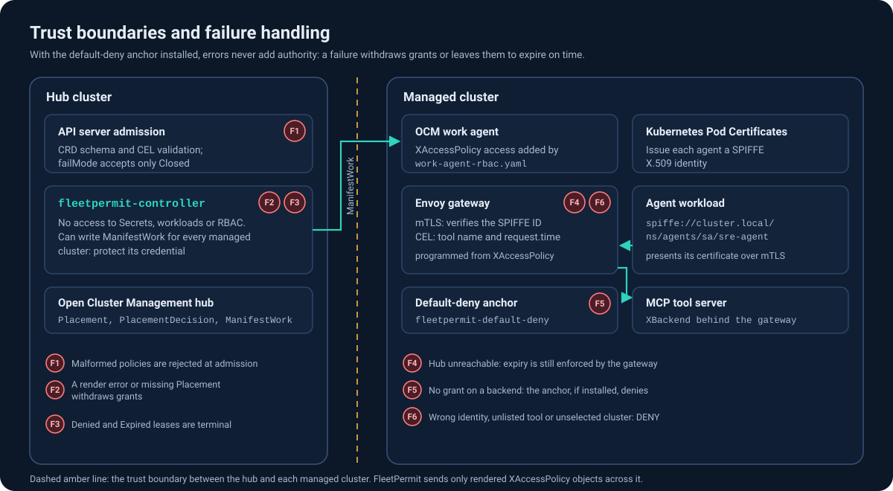

# Security model

## Principles

1. The ceiling and the activation are separate objects. A `FleetAccessPolicy` defines the maximum. A
   `ToolAccessLease` activates part of it for a bounded time. Kubernetes RBAC decides who may write
   each, so a team can let on-call engineers create leases without letting them change the ceiling.
2. Authorization is enforced where the call happens. The gateway in front of the tool server checks
   identity, tool and time. The hub makes decisions but does not sit in the request path.
3. With the default-deny anchor installed, errors never add authority. Each failure FleetPermit
   handles either withdraws grants or leaves them to expire on time:
   - no placement: nothing is delivered, and existing grants are withdrawn;
   - rendering error: that cluster's grants are withdrawn;
   - lease violates the policy: the lease is `Denied`, which is terminal;
   - lease expired: the gateway denies, and the controller withdraws the grant;
   - hub or controller unavailable: delivered leases still expire on time, and nothing new is granted.

   Standing grants (`lease.required: false`) have no expiry; they last until the policy or its
   placement changes. `failMode` accepts only `Closed`. On a cluster that FleetPermit does not
   currently select, or has withdrawn from, the backend is closed only when the anchor is installed;
   on selected clusters FleetPermit's inert policy also denies. Without the anchor,
   kube-agentic-networking v0.2.0 enforces nothing on a target that has no `XAccessPolicy`
   (scenario A1), so the anchor is part of the installation.
4. Leases are subsets. A lease can narrow tools, duration and clusters, never widen them. Its spec
   cannot be edited after creation.
5. Delivered rules are traceable. Every delivered object carries the source policy, its UID and
   generation, the cluster and a SHA-256 content digest. Objects with lease grants also list the
   lease UIDs and the latest expiry, so a rule found on a cluster leads back to the request that
   created it.

## Who can do what

| Principal | Needs | Can |
|---|---|---|
| Platform team | write `fleetaccesspolicies`, `placements` | define ceilings and cluster selection |
| On-call / automation | create `toolaccessleases` | activate a subset of a ceiling for a bounded time |
| FleetPermit controller | see [RBAC](operations.md#rbac) | read policies, leases, placements and clusters; write ManifestWork and status |
| Agent workload | a SPIFFE identity | call tools that an active lease grants it |

Grant `create` on `toolaccessleases`. Do not grant `update` (the spec is immutable anyway), and grant
`delete` only to principals that should be able to revoke early. Grant write access to
`toolaccessleases/status` to the controller only: a lease without `spec.duration` keeps its expiry in
`status.expiresAt`, and a principal that can write it could extend that lease up to the policy's
`maxDuration`.

The controller itself is a privileged identity on the hub. It has no access to the Secret, workload
or RBAC APIs, but its `ManifestWork` permissions cover every managed-cluster namespace: it can read
content other tools deliver through `ManifestWork` (which can include Secrets), and it can create and
update `ManifestWork` that the OCM work agent applies on the managed cluster. The `--work-executor`
flag makes the work agent check FleetPermit's content against a restricted managed-cluster
ServiceAccount before applying it (not exercised by the lab tests). It does not stop a stolen
controller credential on its own; see [RBAC](operations.md#rbac).

## Identity

FleetPermit subjects are SPIFFE IDs. FleetPermit never issues, stores or sees credentials. The gateway
authenticates the caller from its mTLS peer certificate. In the lab those certificates are issued per
pod by Kubernetes Pod Certificates through the kube-agentic-networking signer
(`spiffe://cluster.local/ns/<namespace>/sa/<serviceaccount>`). The managed clusters share one CA, so an
identity issued on one cluster is trusted by the gateways of the others. In production, use a SPIFFE
trust domain whose trust bundle is distributed to every gateway, for example through SPIRE federation.

## Data plane limits

These limits come from the upstream data plane that FleetPermit uses:

- Tool matching is by exact tool name. kube-agentic-networking v0.2.0 does not match argument values.
- A denied call is answered by the gateway with HTTP 200 and a JSON-RPC error with code 403.
- Lease rules (CEL) apply to `tools/call` only. MCP base protocol traffic (`initialize`, `tools/list`,
  `ping`, `completion/*`, `logging/*`, `notifications/*`, the event stream and session close) is
  allowed per subject by a separate inline rule that has no time bound in the data plane. The
  controller removes that rule when the subject has no grant left on the cluster.
- Upstream allows at most 5 `XAccessPolicy` objects per target and 10 rules per object.
- The upstream APIs (`XAccessPolicy` v1alpha1, `XBackend` v0alpha0) are experimental.

See the [threat model](threat-model.md) for the full analysis and residual risks.
